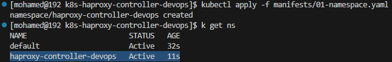
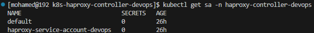
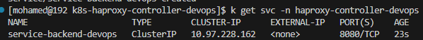
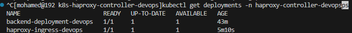
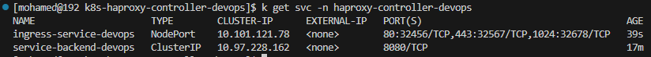

# 🧭 Kubernetes HAProxy Controller DevOps Setup

This repository documents the step-by-step setup of an HAProxy-based ingress controller on Kubernetes using Minikube.  
All manifests are stored under the **/manifests** directory, and screenshots under **/screenshots**.

---

## 🧱 Environment
- **Platform:** Red Hat 9.6  
- **Kubernetes:** v1.30.0 (via Minikube)  
- **Driver:** Docker  

---

## 🧩 Step 1 — Create Namespace

### 🎯 Goal
Create a dedicated namespace called **`haproxy-controller-devops`** to isolate all HAProxy ingress resources.

**Manifest:** [01-namespace.yaml](./manifests/01-namespace.yaml)

**Commands:**
```bash
kubectl apply -f manifests/01-namespace.yaml
kubectl get ns
```

📸 Screenshot:  


---

## 🧩 Step 2 — Create ServiceAccount

### 🎯 Goal
Create a ServiceAccount named **`haproxy-service-account-devops`** under the same namespace (**`haproxy-controller-devops`**) that will be used by the HAProxy ingress controller to access cluster resources securely.

**Manifest:** [02-serviceaccount.yaml](./manifests/02-serviceaccount.yaml)

**Commands:**
```bash
kubectl apply -f manifests/02-serviceaccount.yaml
kubectl get sa -n haproxy-controller-devops
```

📸 Screenshot:  


---

## 🧱 Step 3 — Create ClusterRole

### 🎯 Goal
Create a ClusterRole named **`haproxy-cluster-role-devops`** that grants HAProxy permissions to interact with required Kubernetes objects (pods, services, configmaps, etc.).

**Manifest:** [03-clusterrole.yaml](./manifests/03-clusterrole.yaml)

**Commands:**
```bash
kubectl apply -f manifests/03-clusterrole.yaml
kubectl get clusterrole | grep haproxy
```

📸 Screenshot:  


## 🧩 Step 4 — Create ClusterRoleBinding

### 🎯 Goal
Bind the **ClusterRole** `haproxy-cluster-role-devops` to the **ServiceAccount** `haproxy-service-account-devops` under the namespace **`haproxy-controller-devops`**.  
This allows the HAProxy controller to actually use the permissions defined in the ClusterRole.

**Manifest:** [04-clusterrolebinding.yaml](./manifests/04-clusterrolebinding.yaml)

**Commands:**
```bash
kubectl apply -f manifests/04-clusterrolebinding.yaml
kubectl get clusterrolebinding | grep haproxy
```

📸 Screenshot:  


## 🧩 Step 5 — Create Backend Deployment

### 🎯 Goal
Deploy the default backend service for HAProxy.  
This deployment provides a simple default response for any request that doesn’t match other routes handled by the ingress controller.

**Manifest:** [05-backend-deployment.yaml](./manifests/05-backend-deployment.yaml)

**Commands:**
```bash
kubectl apply -f manifests/05-backend-deployment.yaml
kubectl get deployment -n haproxy-controller-devops
```

📸 Screenshot:  


## 🧩 Step 6 — Create Backend Service

### 🎯 Goal
Expose the backend deployment internally within the cluster so that the HAProxy ingress controller can route traffic to it.  
This service links to the backend pods using the `run=ingress-default-backend` label.

**Manifest:** [06-backend-service.yaml](./manifests/06-backend-service.yaml)

**Commands:**
```bash
kubectl apply -f manifests/06-backend-service.yaml
kubectl get svc -n haproxy-controller-devops
```


📸 Screenshot:  



## 🧩 Step 7 — Create Frontend (HAProxy Ingress) Deployment

### 🎯 Goal
Deploy the **HAProxy Ingress Controller**, which will route external traffic into the cluster.  
This deployment uses the ServiceAccount and ClusterRole we created earlier and connects to the backend service as its default route.

**Manifest:** [07-frontend-deployment.yaml](./manifests/07-frontend-deployment.yaml)

**Commands:**
```bash
kubectl apply -f manifests/07-frontend-deployment.yaml
kubectl get deployments -n haproxy-controller-devops
```

📸 Screenshot:  



## 🧩 Step 8 — Create Frontend Service (NodePort)

### 🎯 Goal
Expose the **HAProxy Ingress Controller** externally so it can receive HTTP and HTTPS traffic from outside the cluster.  
This NodePort service forwards external ports 32456 (HTTP), 32567 (HTTPS), and 32678 (stats) to the HAProxy ingress pods.

**Manifest:** [08-frontend-service.yaml](./manifests/08-frontend-service.yaml)

**Commands:**
```bash
kubectl apply -f manifests/08-frontend-service.yaml
kubectl get svc -n haproxy-controller-devops
```

📸 Screenshot:  



